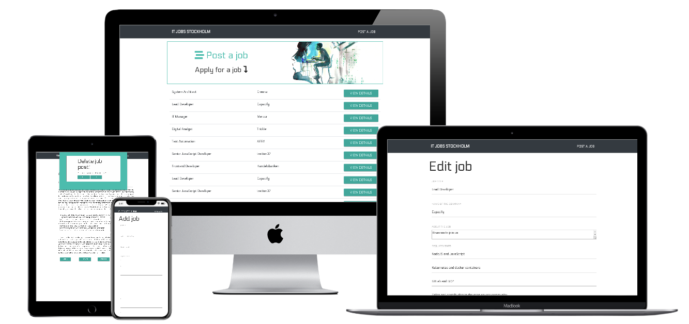
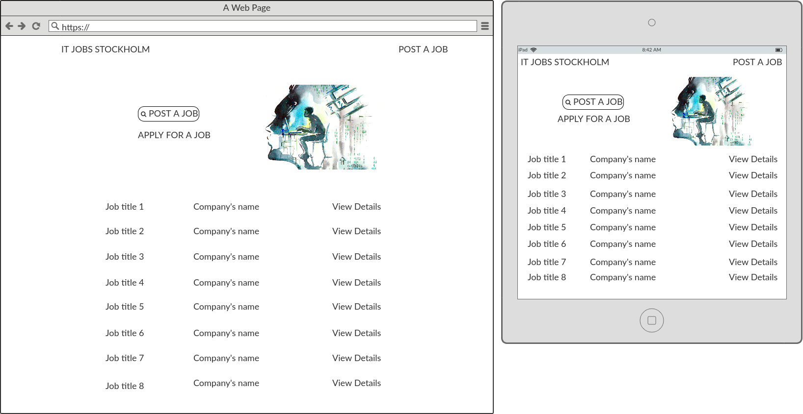
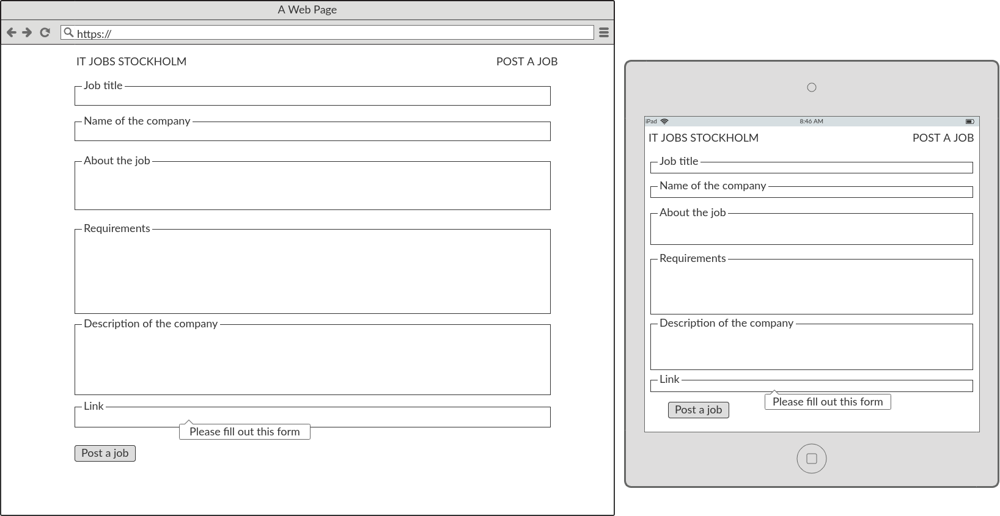
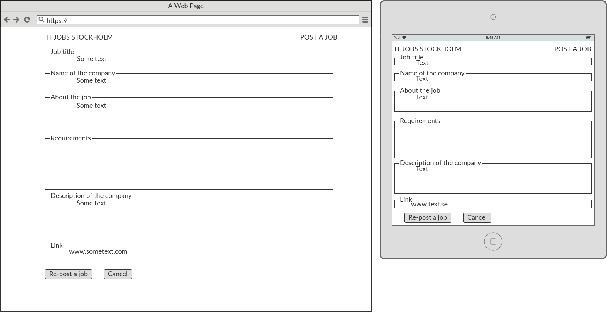
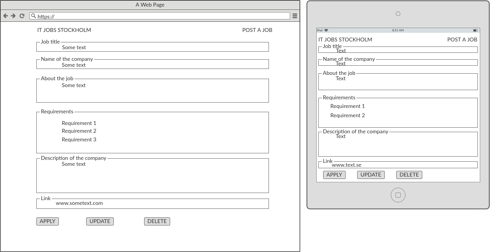
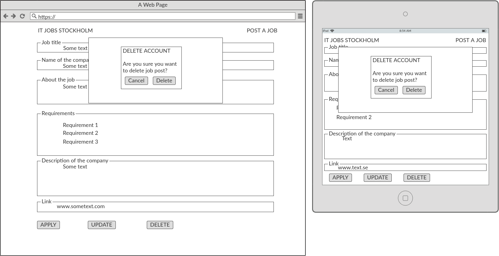
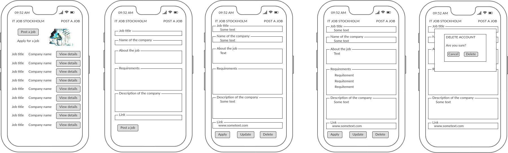
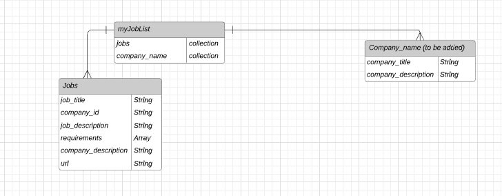
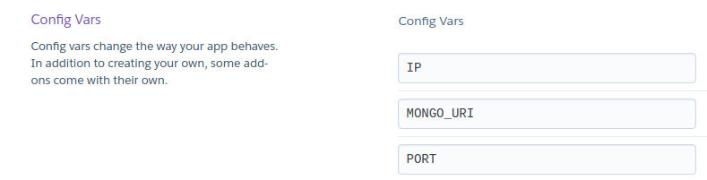

---
 
[THE JOB LIST](https://my-job-list.herokuapp.com/)

---

# UX

**Target audience:** 
The job seeker who is interested in job advertisements.
The employee seeker who wants to post a job advertisement.

**Aim:** 
To enable post and browse job offers for job and/or employees seekers.

**The structure:** 

- MAIN PAGE:
    - Navigation pantel at the top of the webpage allows the user to *Post a job* or navigate back to main page by clicking on the *IT JOBS STOCKHOLM*. 
    - Header section contains two parts. To the right there is an image for visual purpose. To the left the user can be dynamically re-dicerted to *Post a job* sub-page and read a static heading about a posibbility of browsing job offers underneath. 
    - Below there is a list with available job offers. Each line has a *job title*, *company name* and a button re-directing the user to a sub-page *JOB DETAILS*  

- POST A JOB
    - One page with form to fill in as follows:
        - Job title
        - Name of the company
        - Job description
        - List of requiremens
        - Description of the company
        - Website linking to the original job offers
    - A button *POST A JOB* which creats the job offers
    - The user will not be able to post a job offer unless he fills in the input.
    - All input required to be text ecept *Link to original job post* which must be an url
    - If the user changes his mind then he can be back to the main page by clicking on the logo in the navigation panel
    - Clicking *Post a job* button redirects the user to sub-page *JOB DETAILS* where he can see his job being created 

- JOB DETAILS
    - Silmpe, one page view with the clear heading at the top and then as follows underneath:
        - Job title
        - Name of the company
        - Job description
        - List of requiremens
        - Description of the company
    - Three buttons with actions:
        - *Apply* which redirects the user to new browser tab with thr original job post website
        - *Update* which redirects the user to sub-page allowing editing the post job
        - *Delete* which triggers confirmation model asking the user is he sure to delete the job post.

- UPDATE JOB
    - The sub-page allows the user to edit already existing job offer
    - The user can *Re-post the job* which re-directs him to the main page with the list of all job offers
    - The user can change his mind by clicking on *Cancel* button which redirects him back to the job offer he wanted to edit
    - The user can take no action by clicking on the logo in navgation menu at the top of the website
    
- Delete
    - The job offer can be deleted by clicking on the button *Delete* in the *View details* sub-page. Clicking on the *Delete* button will trigger confirmation model with the question is the user sure to delete a job post. The user have two options:
        - *Cancel* which take no action so the user is still in the *Job view* sub-page
        - *Delete* which re-directs him to the mian page
    

**Wireframes**

 
 
 
 
 
 

**The project is fully responsive**

**USER STORIES:**

- As a job seeker I want to be able to read job offers at home website.
- As a job seeker I want to be able to click on view details to see job description.
- As a job seeker I want to apply for a job add.
- As a employee seeker I want to create and post a job ads so potential employees can apply.
- As a employee seeker I want to update already posted job ad.
- As a employee seeker I want to delete posted job ad.

 # FEATURES

*EXISTING FEATURES:*
- Logo in navigation panel: clicking on it redirectes the user to the mian page from any sub-page
- *Post a job* in the navigation panel which redirects you to *Add job* sub-page
- *Post a job* link in the header section which redirects you *Add a job* sub-page
- *View details* button
- *Apply* button
- *Update* button
- *Delete* button
- Confirmation model ensuring the action of the user

*FUTURE FEATURES TO IMPLEMENT*
- Sing up as a new user
- Login as a user 
- Serach input
- Dropdown list with already exisiting companies in the data base (additinal data collection in MongoDB)
- List of jobs saved to apply later
- Promotion video about professional life in Stockholm

# TECHNOLOGIES

- HTML/HTML5
- CSS/CSS3
- Python

> In the future to be extended with JS as additinal visual effects and connecting to API

**Hosting service**
- GitHub
- Heroku

**Database**
- Atlas MongoDB (one collection: jobs)

**Frameworks:**
- Flask
- Jinja
- PyMongo
- Materialize
- Bootstrap
- Bulma (installed and used at the beginning but eventually changed for Materialized)

**Other:**
- Font Awesome
- Google fonts
- Adobe Stock

**Tools:**
- Gitpod
- Balsamiq
- Lucidchart
- Miro
- Slack

# DATA STRUCTURE

    - Database: Atlas MongoDB

 

# TESTING

**The project has been tested manually**

**VALIDATORS:**

- HTML: no errors found.
- CSS: no erros found.
- Pep8: all right.

**BROWSERS**
- Chorme: fully supported
- FireFox: fully supported

**TESTING USER STORIES**
- As a job seeker I want to be able to read job offers at home website.
- As a job seeker I want to be able to click on view details to see job description.
- As a job seeker I want to apply for a job add.
- As a employee seeker I want to create and post a job ads so potential employees can apply.
- As a employee seeker I want to update already posted job ad.
- As a employee seeker I want to delete posted job ad.

**TESTING FEATURES**
- Logo in navigation panel
- *Post a job* link in the header section
- *View details* button
- *Apply* button
- *Update* button
- *Delete* button
- Confirmation model'S buttons: cancel and delete

**All User Stories and features were tested on all size devices and no bugs were spoted**

# DEPLOYMENT

**HEROKU**

1. Make an account on [heroku](https://dashboard.heroku.com/)
2. Create an application
3. In the section *Deploy* choose *deployment method:* Connect with GitHub
4. Connect with your GitHub repository you want to deploy
5. Choose the brunch to deploy 
6. Deploy
7. [View the application](https://my-job-list.herokuapp.com/)

> Please note: 
> In the section *Setting* you must specify **Confing Vars** 
> 

**GitHub**

The [repository](https://github.com/annaweronica/MyJobList) is hosted on github with one master branch.
Commends below were made as the work incrementation was made progressively and prevented from any code incrementation loss.

- git add .
- git commit -m "name"
- git push

# CREDITS

**External resouces supporting me during my work:**
- https://bootstrapious.com/p/bootstrap-navbar-with-logo
- https://bootstrapious.com/p/bootstrap-sticky-footer
- https://www.w3schools.com/howto/howto_css_delete_modal.asp

**Huge thank you!**

- Kevin, Xav! for patience and clarifying and explaining and teaching!
- Aaron for guidance. 
- Tim, Anna and Scott for tutor support!

--------

Enjoy!
